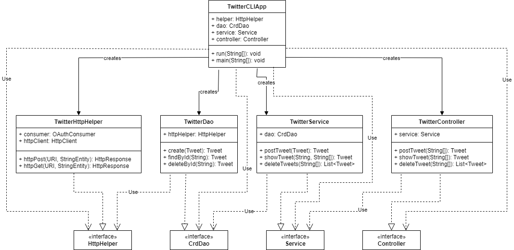

# Introduction
This application will read user input containing a keyword and a set of arguments and perform a REST API operation
depending on what information was included in the user input. A Twitter Developer account with elevated access was 
created along with a pair of SSH keys for authentication. Notable technologies used in this application include OAuth
for executing HTTP requests, Google GSON for parsing JSON formatted strings into Tweet objects, Mockito and JUnit to 
test and verify each of the application's methods. Finally, Maven and Spring were used for dependency management and 
Docker was used for deployment.

# Quick Start

To package this application using Maven, the SSH keys and tokens for your Twitter account first need to be exported as 
environment variables. This is done by typing the following:
```
export accessToken=[your access token]
export consumerKey=[your consumer key]
export consumerSecret=[your consumer secret]
export tokenSecret=[your token secret]
```
Once the keys and tokens have been stored into environment variables, run the command `mvn clean package`.

To run this application with Docker, the SSH keys and tokens for the Twitter account are also needed. 
The application can be run by entering the following command
`docker run -e accessToken=[your access token] -e consumerKey=[your consumer key] -e 
consumerSecret=[your consumer secret] -e tokenSecret=[your token secret] [image name] [your query]`

Alternatively, if the keys and tokens are already stored in environment variables, you can simply pass them into the
run command itself
`docker run -e [access token env. variable] -e [consumer key env. variable] -e [consumer secret env. variable] 
-e [token secret env. variable] [image name] [your query]`

Finally, if the keys and tokens are stored in an .env file, that file can be passed into the run command as well
`docker run --env-file [file path] [image name] [your query]`

Keep in mind, that when passing in a file, the keys and tokens need to be formatted like so
```
accessToken=[your access token]
consumerKey=[your consumer key]
consumerSecret=[your consumer secret]
tokenSecret=[your token secret]
```

This application will run three different kinds of queries:

`GET <tweet id> [field1] [field2] [field3] ...`

The GET command will retrieve the tweet with the given id and the content of the given fields. All the valid fields
are listed in the Models section.

`POST <tweet text>`

The POST command will create a new tweet with the given text.

`DELETE <id1> [id2] [id3] ...`

The DELETE command will delete the tweet with the given id. If more than one id is given, all the tweets that contain
a given id will be deleted.

# Design
## UML diagram

## Components
- `HttpHelper` executes HTTP requests using given URIs and String Entities.
- `CrdDao` prepares URIs for the `HttpHelper` component and parses the responses into Tweet objects.
- `Service` verifies the input of each HTTP request, ensuring only valid requests are made.
- `Controller` parses the user input of each HTTP request.
- `TwitterCLIApp` initializes the application and creates each component.

## Models
When designing the model for the Tweet object, we tried to make the model as similar to an actual tweet as possible.
However, due to the scope of the project, we had to settle for a simplified version of Twitter's tweet with many of
the fields left out. Our Tweet object contains the following attributes:

- `created_at` contains the timestamp indicating when this tweet was created.
- `id` contains this tweet's id for retrieval operations.
- `id_str` contains this tweet's id but in a String format.
- `text` contains this tweet's content.
- `entities` is a collection which contains this tweet's hashtags and user mentions. Each hashtag and user mention 
also contains indices indicating their start and finish within the text as well as the relevant text or user 
respectively.
- `coordinates` contains the location where this tweet was created using a latitude, longitude format.
- `retweetCount` contains the number of times this tweet was retweeted.
- `favouriteCount` contains the number of times this tweet was favourited.
- `retweeted` indicates whether this tweet was retweeted or not.
- `favourited` indicates whether this tweet was favourited or not.

## Spring
`TwitterHttpHelper`, `TwitterDao`, `TwitterService`, `TwitterController` and `TwitterCLIApp` are marked as Components 
and have been autowired. `TwitterCLIComponentScan` acts as the configuration file and scans the package to ensure that 
these autowired components are processed by the Spring container when it is created. Once the components have been 
processed, bean definitions and service requests for these beans are generated at runtime.

# Test
Unit and Integration test scripts were written using JUnit. Mockito was used to mock external methods and classes in
unit tests so only the code in the method in question was tested. JUnit annotations such as `@Before` allowed us to 
initialize key components such as dependency classes and SSH keys before each test. 

## Deployment
This application was deployed using Docker. A docker file was first created which copies the .jar file into a location
on the user's computer and then sets up an entrypoint command for running the .jar file. An image was then built from
this docker file and pushed onto Docker Hub

# Improvements
- While it may be generally frowned upon to skip parts of the testing process, I would have omitted writing the
majority of the unit tests in this project. The Twitter API as well as external methods are too central in the
implementation of each method. Thus, after mocking each method and class, it is meaningless to test what code is left
in a unit setting.
- The GET command requires that the user specify a set of fields to retrieve. I would have liked to set the GET command 
to retrieve all fields by default, should the user not have specified any fields. Unfortunately, setting default
parameter values is not a feature supported by Java.
- If the scope allowed for it, I would have liked to implement a Graphical User Interface for this application. 
Issuing commands with a terminal can be confusing whereas using an interface with buttons and text fields is much
simpler.
